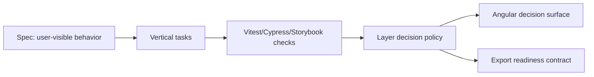

# Architecture

## Overview

The workbench is a single Angular 20 application that models a Metria-like GIS decision-support slice.
The important architecture is not the UI itself; it is the split between observable product
behavior and implementation details.

## Module Boundaries

- `src/app/layer-decision-support/layer-access-policy.ts` is the deep module. It owns role checks, selected layer normalization, render ordering, projection warnings, and export readiness.
- `src/app/app.ts` owns local UI state and delegates behavior to the policy module.
- `src/app/layer-decision-support/layer-catalog.fixture.ts` is deterministic workshop data. Replace this with Apollo/GraphQL data only after the behavior is stable.
- `cypress/e2e/` validates the workshop-critical path from the user's perspective.

## Data Flow

1. UI state supplies selected layer IDs, active roles, locale, and map projection.
2. The policy receives this state plus layer metadata.
3. The policy returns a view model: ordered decisions, warnings, blocked count, selected IDs, and export formats.
4. The Angular component renders the view model without reimplementing the rules.

## Extension Points

- Apollo/GraphQL can replace the static catalog by preserving the `DecisionLayer` boundary.
- OpenLayers/ArcGIS rendering can consume `visibleLayerIds`.
- Export generators can consume `selectedLayerIds` and `exportFormats`.
- Keycloak/angular-oauth2-oidc can feed roles into the policy.
