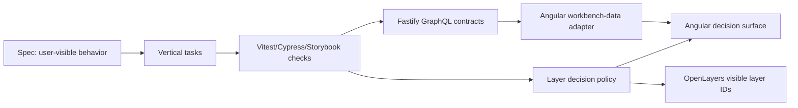

# Architecture

## Overview

The workbench is an Nx monorepo with an Angular 20 map application, a Fastify/Mercurius
GraphQL API, and a separate Cypress e2e project. The important architecture is not the UI
itself; it is the split between observable product behavior and implementation details.

## Module Boundaries

- `apps/api/src/domains/geodata/` owns the backend workbench domain: GraphQL schema, resolvers, repository seed data, search, layer catalog, and map feature geometry.
- `apps/api/src/server.ts` owns the Fastify server factory, CORS, REST health routes, and GraphQL plugin registration. Keep it injectable so tests can use `server.inject`.
- `apps/web/src/app/map-workbench/workbench-data/` owns the frontend GraphQL adapter and DTO-to-domain mapping.
- `apps/web/src/app/map-workbench/layers/layer-access-policy.ts` owns role checks, selected layer normalization, and render ordering.
- `apps/web/src/app/map-workbench/search/` owns search target display formatting.
- `apps/web/src/app/map-workbench/map-workbench.ts` owns local UI state, OpenLayers orchestration, and delegates data/policy work to public seams.
- `apps/web/src/app/shared/` contains cross-feature contracts such as `GraphqlClient` and `UserRole`.
- `apps/web-e2e/src/e2e/` validates the workshop-critical path from the user's perspective.

## Data Flow

1. Fastify exposes `/graphql` through Mercurius.
2. `mapWorkbench` returns layer metadata, default selection, default search target, and map feature geometry.
3. `searchTargets(query:, limit:)` returns backend-owned search target results.
4. Angular `MapWorkbenchApi` posts GraphQL operations through `GraphqlClient` and maps nullable GraphQL DTOs into app domain models.
5. UI state supplies selected layer IDs and active roles to the layer policy.
6. The policy returns a view model: ordered decisions, blocked count, selected IDs, and visible layer IDs.
7. The Angular component renders the view model and turns backend map feature geometry into OpenLayers features.

## Extension Points

- Fastify repositories can replace current in-memory geodata with database-backed data by preserving the GraphQL schema.
- OpenLayers rendering consumes `visibleLayerIds`.
- Keycloak roles feed into the policy through the app-level `UserRole` boundary.
