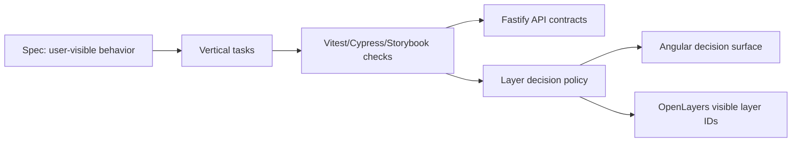

# Architecture

## Overview

The workbench is an Nx monorepo with an Angular 20 map application, a Fastify API, and a
separate Cypress e2e project. The important architecture is not the UI itself; it is the split
between observable product behavior and implementation details.

## Module Boundaries

- `apps/web/src/app/layer-decision-support/layer-access-policy.ts` is the deep module. It owns role checks, selected layer normalization, and render ordering.
- `apps/web/src/app/` owns local UI state and delegates behavior to the policy module.
- `apps/web/src/app/layer-decision-support/layer-catalog.fixture.ts` is deterministic workshop data. Replace this with API data only after the behavior is stable.
- `apps/api/src/server.ts` owns the Fastify server factory and route registration. Keep it injectable so tests can use `server.inject`.
- `apps/web-e2e/src/e2e/` validates the workshop-critical path from the user's perspective.

## Data Flow

1. UI state supplies selected layer IDs and active roles.
2. The policy receives this state plus layer metadata.
3. The policy returns a view model: ordered decisions, blocked count, selected IDs, and visible layer IDs.
4. The Angular component renders the view model without reimplementing the rules.

## Extension Points

- Fastify routes can replace the static catalog by preserving the `DecisionLayer` boundary.
- OpenLayers rendering consumes `visibleLayerIds`.
- Keycloak roles feed into the policy through the app-level `UserRole` boundary.
