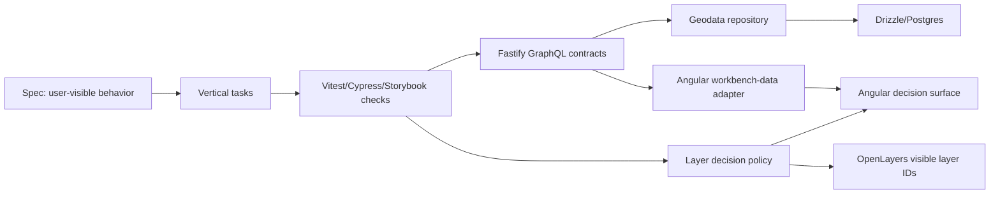

# Architecture

## Overview

The workbench is an Nx monorepo with an Angular 20 map application, a Fastify/Mercurius
GraphQL API, a Drizzle/Postgres data layer, and a separate Cypress e2e project. The important
architecture is not the UI itself; it is the split between observable product behavior and
implementation details.

## Module Boundaries

- `apps/api/src/domains/geodata/` owns the backend workbench domain: GraphQL schema, resolvers, repository seed data, search, layer catalog, and map feature geometry.
- `apps/api/src/domains/geodata/geodata.repository.ts` is the repository interface. Runtime uses `DrizzleGeodataRepository`; tests use `InMemoryGeodataRepository`.
- `apps/api/src/db/schema.ts` is the Drizzle schema. `apps/api/drizzle/` contains generated SQL migrations. `apps/api/src/db/migrate.ts` and `apps/api/src/db/seed.ts` are the local runners.
- `apps/api/src/server.ts` owns the Fastify server factory, CORS, REST health routes, and GraphQL plugin registration. Keep it injectable so tests can use `server.inject`.
- `apps/web/src/app/map-workbench/workbench-data/` owns the frontend GraphQL adapter and DTO-to-domain mapping.
- `apps/web/src/app/map-workbench/layers/layer-access-policy.ts` owns role checks, selected layer normalization, and render ordering.
- `apps/web/src/app/map-workbench/search/` owns search target display formatting.
- `apps/web/src/app/map-workbench/map-workbench.ts` owns local UI state, OpenLayers orchestration, and delegates data/policy work to public seams.
- `apps/web/src/app/shared/` contains cross-feature contracts such as `GraphqlClient` and `UserRole`.
- `apps/web-e2e/src/e2e/` validates the workshop-critical path from the user's perspective.

## Data Flow

1. `npm run services` starts app Postgres, waits for it, applies Drizzle migrations, and seeds workbench geodata.
2. Fastify exposes `/graphql` through Mercurius.
3. GraphQL resolvers call geodata services/repositories.
4. The runtime repository reads Drizzle/Postgres rows for layer metadata, default selection, default search target, search targets, and map feature geometry.
5. Angular `MapWorkbenchApi` posts GraphQL operations through `GraphqlClient` and maps nullable GraphQL DTOs into app domain models.
6. UI state supplies selected layer IDs and active roles to the layer policy.
7. The policy returns a view model: ordered decisions, blocked count, selected IDs, and visible layer IDs.
8. The Angular component renders the view model and turns backend map feature geometry into OpenLayers features.

## Extension Points

- Drizzle repositories can swap from seeded local tables to richer production geodata tables by preserving the repository interface and GraphQL schema.
- OpenLayers rendering consumes `visibleLayerIds`.
- Keycloak roles feed into the policy through the app-level `UserRole` boundary.
